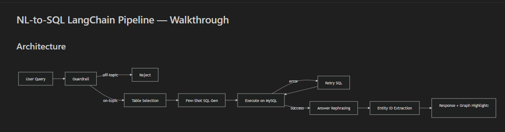
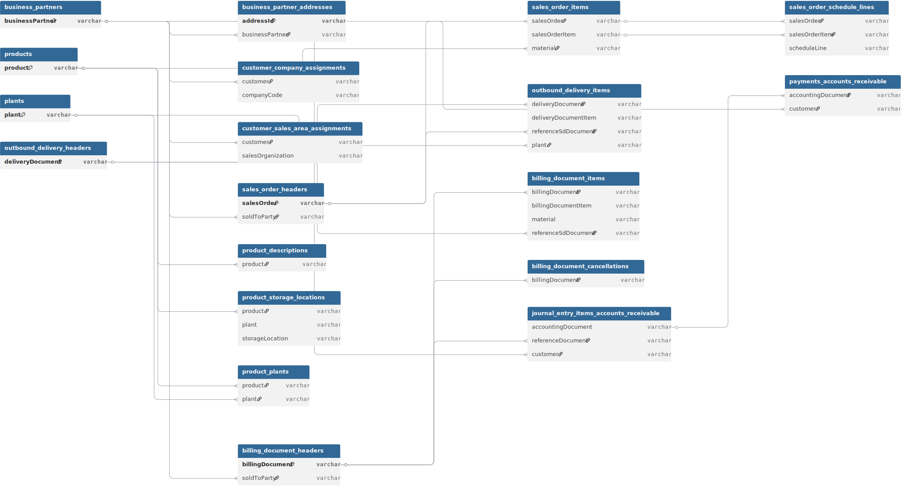
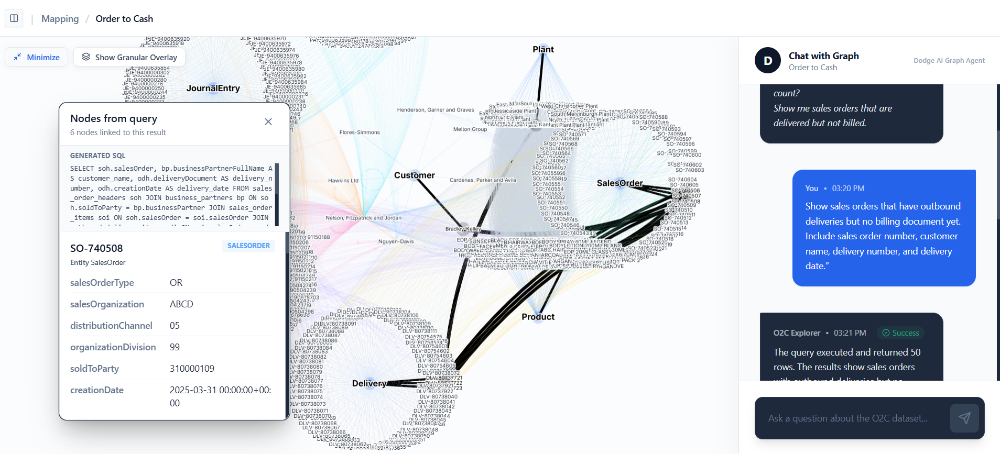
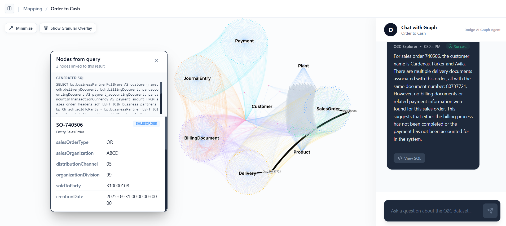
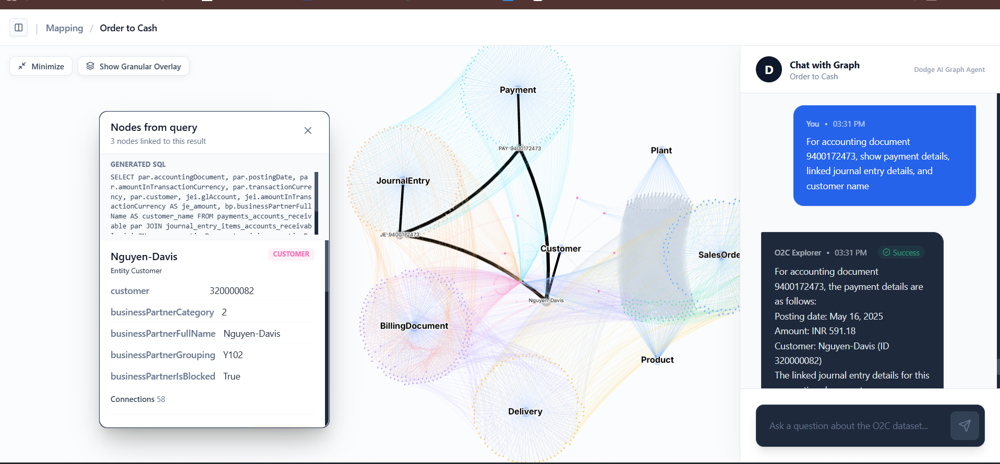

# SAP O2C Graph + NL-to-SQL

Frontend URL: [https://sap-o2c-graph-chat.vercel.app/](https://sap-o2c-graph-chat.vercel.app/)  
Backend URL: [https://sap-o2c-graph-chat.onrender.com/](https://sap-o2c-graph-chat.onrender.com/)

A lightweight Order-to-Cash explorer with:
- interactive graph visualization
- NL-to-SQL chat (LangChain + Groq)
- MySQL-backed query execution

## NL-to-SQL architecture



## Graph builder table schema

The graph/data model used by `graph-builder`:



## Project structure

- `o2c-app/frontend` - React + Vite UI (graph + chat)
- `o2c-app/backend` - FastAPI API
- `o2c-app/backend/nl-to-sql` - NL-to-SQL pipeline (canonical location)
- `graph-builder` - loads CSV entities into MySQL
- `data-processing` - preprocessing outputs used for graph/database

## Key capabilities

- Ask natural-language O2C questions and get SQL + answers.
- Highlight graph nodes directly from query results and SQL entity extraction.
- Expand neighborhoods for node-level investigation in the graph UI.
- Use one backend service (`o2c-app/backend`) with embedded NL-to-SQL pipeline.

## Optional things done

- Natural language to SQL or graph query translation
- Highlighting nodes referenced in responses
- Streaming responses from the LLM

## Architecture decisions and decision-making

### 1) System architecture
- **Decision:** Monorepo with separated concerns: `frontend` (UI), `backend` (API), `backend/nl-to-sql` (LLM pipeline), `graph-builder` (DB loading), `data-processing` (source artifacts).
- **Why:** Keeps deployment simple (frontend + backend only) while preserving clear ownership of data prep and graph/db build steps.
- **Trade-off:** Some path coupling across folders; mitigated by keeping canonical NL-to-SQL code under `o2c-app/backend/nl-to-sql`.

### 2) Database choice (MySQL)
- **Decision:** MySQL-compatible managed service (Aiven) with app connectivity via `MYSQL_URL`.
- **Why:** Fits relational O2C data and LangChain SQL tooling; easy portability across local/cloud.
- **Trade-off:** Provider-specific defaults (TLS, primary-key enforcement, connection params) require loader/runtime handling.

### 3) LLM prompting strategy
- **Decision:** Multi-stage prompting instead of one-shot SQL generation:
  1. guardrail classification  
  2. relevant table selection  
  3. few-shot SQL generation  
  4. SQL execution + retry/fix loop  
  5. answer rephrasing  
  6. entity extraction for graph highlights
- **Why:** Improves SQL quality, lowers hallucination risk, and gives better debuggability (`View SQL`, stage-wise logs).
- **Trade-off:** More moving parts than one prompt, but better control and error recovery.

### 4) Guardrails and safety
- **Decision:** Two-layer guardrail (`keyword` + `LLM`) plus explicit off-topic rejection message.
- **Why:** Fast cheap filter for obvious off-topic inputs, with LLM fallback for ambiguous phrasing.
- **Trade-off:** Can still over-reject/under-reject edge cases; handled via transparent messaging and SQL visibility.

### 5) API response strategy
- **Decision:** Keep both standard and streaming modes:
  - `POST /api/query` (single JSON response)
  - `POST /api/query/stream` (SSE incremental chunks)
- **Why:** Streaming improves UX for long generations while preserving compatibility with non-stream clients.
- **Trade-off:** Slightly more frontend/backend complexity to maintain both paths.

## Environment variables

### Backend (`o2c-app/backend/.env`)
- `GROQ_API_KEY`, `GROQ_MODEL`
- `MYSQL_URL` (preferred) or `DB_USER/DB_PASSWORD/DB_HOST/DB_PORT/DB_NAME`
- `FRONTEND_URL` (CORS origins, comma-separated)

### Frontend (`o2c-app/frontend/.env`)
- `VITE_API_URL=https://<your-backend-domain>`

## API endpoints

- `GET /` - basic service status
- `GET /api/health` - DB connectivity and table count
- `POST /api/query` - NL question to SQL+answer pipeline

## Run locally

### 0) First-time setup (create/load MySQL tables)
Run this before using the chat API for the first time:
```bash
cd graph-builder
python -m venv venv
# Windows: venv\Scripts\activate
pip install -r requirements.txt
python load_to_mysql.py
```

### 1) Backend
```bash
cd o2c-app/backend
python -m venv venv
# Windows: venv\Scripts\activate
pip install -r requirements.txt
uvicorn main:app --reload --port 8000
```

### 2) Frontend
```bash
cd o2c-app/frontend
npm install
npm run dev
```

### 3) Re-load MySQL tables (when source CSVs change)
If you regenerate data in `data-processing/output/entities`, run:
```bash
cd graph-builder
# Activate existing venv, then:
python load_to_mysql.py
```

## Deploy (quick)

- **Backend (Render)**
  - Root: `o2c-app/backend`
  - Build: `pip install -r requirements.txt`
  - Start: `uvicorn main:app --host 0.0.0.0 --port $PORT`
  - Set env vars in Render dashboard

- **Frontend (Vercel)**
  - Root: `o2c-app/frontend`
  - Set `VITE_API_URL` to your Render backend URL

## Sample outputs

### Query example 1


### Query example 2


### Query example 3


## AI coding session logs

We keep AI-assisted development logs for traceability and handover quality.

- `ai-session-logs/cursor/`
- `ai-session-logs/claude-code/`
- `ai-session-logs/copilot/`
- `ai-session-logs/summary.md`

Each session log should include:
- date/time
- tool name
- objective
- key prompts
- decisions made
- files changed
- result and next steps

### Automatic export from `.jsonl` transcripts

You can generate redacted markdown summaries automatically:

```bash
python scripts/export_chat_logs.py \
  --input-dir "C:/Users/Kaustubh Duse/.cursor/projects/c-Users-Kaustubh-Duse-OneDrive-Desktop-Dodge-AI/agent-transcripts" \
  --output-dir "ai-session-logs/cursor" \
  --max-files 20
```

Optional flags:
- `--overwrite` to rewrite existing `.md` files
- `--max-files 0` to process all transcripts

Built-in redaction removes common API keys/tokens, DB URLs, and password-like assignments.  
Always review generated logs before commit.

## Notes

- Keep `.env` out of Git.
- `graph-builder/load_to_mysql.py` recreates tables; if your MySQL service enforces primary keys, keep the post-load PK step enabled.
- If frontend shows `localhost:8000` errors in production, set `VITE_API_URL` in Vercel and redeploy.
- Recommended order: **(1) load tables with graph-builder -> (2) start/deploy backend -> (3) run frontend**.
